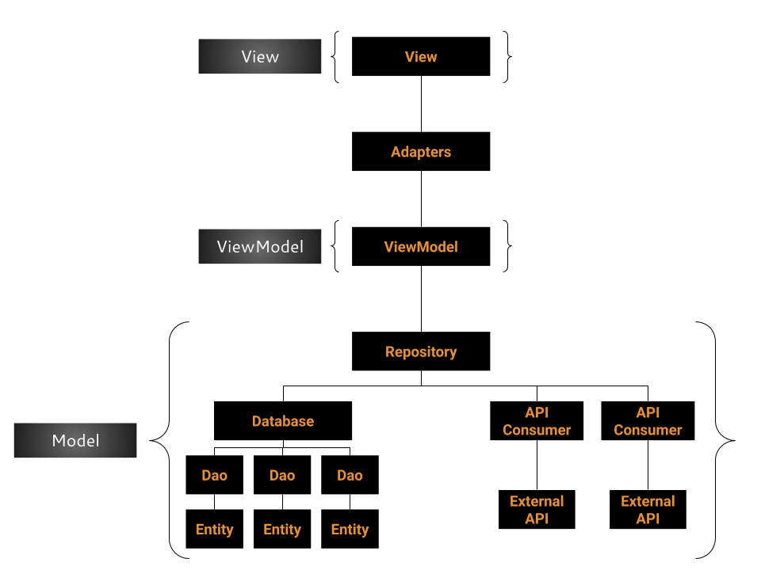

# Comic Shop

## Introduction

Comic Shop is an app made to display several comics for sale, and add them to your checkout.

### Architecture

For this project, I followed the MVVM architecture. 

For the Model layer, I planned on using [Room](https://developer.android.com/topic/libraries/architecture/room). Unfortunately, I couldn't get it to work in time, making me unable to implement the whole database side of the model. With that in mind, the repository is only fed by the API consumer, and has no persistence (yet!). 

For the API consume side of the model, I used [Volley](https://developer.android.com/training/volley/index.html).

Due to the simplicity of the scope, I only needed two entities: one for the comic, and one for a comic reference. The comic one is responsible for storing data acquired through the API consume. The reference one is responsible for storing the id of comics added to checkout, and its amount. I decided to use a simpler data class because there is no need to store the same data twice in the app.

The ViewModel layer completely isolates the Model layer from the View layer, while still providing access to the model data. The other true advantage of ViewModel is being able to be retrieved in a singleton-like fashion through the use of [ViewModelProviders](https://developer.android.com/reference/androidx/lifecycle/ViewModelProviders), making sure that data is the same no matter where the user is in the application. While I could build a ViewModel for each of my entities, I preferred to use only one to rule them all, since both of my entities are related (kinda).

Lastly, the View Layer is the one responsible for displaying the data to the end user through Activities and Fragments. In this specific project, I used a single activity with two fragments: one for the shopping screen, and the other for the checkout screen. The fragments were created inside a [ViewPager](https://developer.android.com/reference/android/support/v4/view/ViewPager), also providing the nice sliding transition.

### UX

Several design decisions were made throughout the development of this app. For starters, the most apparent one is the usage of seemingly only one screen to display two types of actions a user can make: shopping, and checking out. While I could create a button that took the user to another screen just to checkout, often this same user will want to quickly peek into the checkout only, without even taking an action there. This is very useful during that time in which the user thinks "I like this comic, but am I not spending too much here? Let me check!". That's where the ViewPager with Fragments came in. Not only it provides us this smooth peeking transition, but it also allows the user to take any action in there (e.g. changing the amount of comics so they can buy for the whole family, applying discount coupons, actually checking out).

Another design decision, that I always try to focus on in my projects, was the placing of the buttons. I prioritized placing the buttons to the bottom-right corner of each element, the most I could. This happens due to the Thumb Zone, term coined in the book [Designing Mobile Interface](https://www.amazon.com/Designing-Mobile-Interfaces-Patterns-Interaction/dp/1449394639), which describes the zone in which the user finger will most likely feel more confortable to interact with the screen (regarding right-handed users, at least).

Lastly, there is an invisible decision, and that's why it's so important. At first, I tried to fit some extra informations about the comics in the interface, such as the list of creators, list of characters, number of pages, discounted prices, and even the number of issues. As I tried to design a nice interface around it, I realized that none of it was actually important for users who were shopping for Marvel comics. Unless the user is a die-hard fan, they usually only check the comic's title, story description and price. The discounted prices usually come after the coupon is used. With that in mind, I removed as many useless information I could, and greatly shrank the interface.

### Implementation Decisions

One of the greatest things about the MVVM architecture is the Lifecycle-aware components. In summary, these are components that can persist data even though the user changes activities or contexts. One of such components is the [RecyclerView](https://developer.android.com/reference/android/support/v7/widget/RecyclerView.html), which is essentially a fancy Lifecycle-aware ScrollList. Due to the dynamic nature of retrieving data from APIs, this component is particularly powerful for this application.

Another implementation decision was the use of a [PopupWindow](https://developer.android.com/reference/kotlin/android/widget/PopupWindow.html) to display comic information. I opted to use it because it is lighter than a whole Activity, and it's easier to build and destroy, actually. The result is that all data is displayed very quickly.

Yeah, I know, it does not look like a popup in the application, and that happens because I couldn't manage to get every dimension right inside of it. It currently is a popup occupying the whole screen, looking like a new screen, but it is still essentially a popup - even if it's a grown-up one.

## What it does

* Loads comics from the API!
* Loads detailed information for each comic loaded!
* Calculates prices for different types of coupon!
* Marks random 12% of comics retrieved as rare!
* Displays everything in a nice, fluid and quick one-screen application. Never get lost again in more than one screen!

## What needs more work

* The checkout screen is totally implemented, with its respective ViewModel and Model sides. However, it is not integrated with the rest of the application, and cannot be displayed. It currently displays the mockup rendered by the checkout Fragment's Android Studio preview. I need to find a way to integrate data from both screens.
* The colors! The buttons! The graphical design of this application is very basic, and probably not ideal.
* Enable rare marks on the display. It is currently only visible via code.
* Implement the database side.
* Add more visual feedback to buttons.
* Filter comics retrieved with invalid data.
* Retrieve data gradually. It currently waits for all of the images to be retrieved to load the whole list at once.
* Implement loading more 25 entries when user reaches the bottom of the list.
* Implement search filters.
* Tests!

